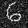

# Denoising Autoencoder

This project focuses on implementing a **Denoising Autoencoder** that removes noise from handwritten digit images, particularly from the **MNIST** dataset. The model learns to reconstruct the images from noisy inputs, thereby improving their quality.

<table> <tr><td></td> <td></td></tr></table>

## Dataset:
- **MNIST**: A dataset of handwritten digits, widely used for image processing tasks.

## Approach:
- The **Denoising Autoencoder** learns how to reconstruct clean images from noisy versions. 
- The model is trained using the MNIST dataset, where random noise is added to the input images, and the autoencoder learns to remove the noise during reconstruction.
- Model architecture:
```
Layer (type)                 | Output Shape           | Param #
-------------------------------------------------------------
input_1 (InputLayer)         | (None, 784)            | 0
dense_1 (Dense)              | (None, 32)             | 25120
dense_2 (Dense)              | (None, 784)            | 25872
-------------------------------------------------------------
Total params: 50,992
Trainable params: 50,992
Non-trainable params: 0
```
## Requirements:
To run this project, you'll need the following libraries:
- TensorFlow / Keras
- NumPy
- Matplotlib
- Scikit-learn

Feel free to explore the code and contribute to further improvements. For any questions, feel free to open an issue or reach out!

